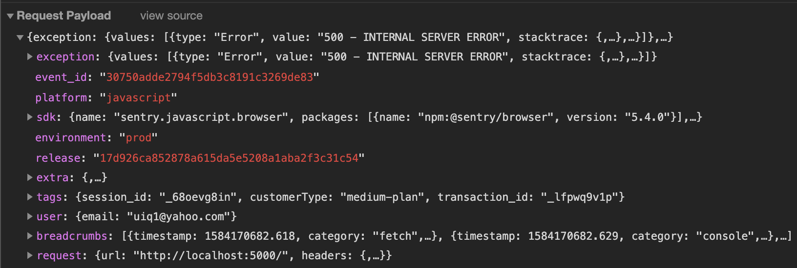

# event-maker

## What's Happening

**2 Things You Can Do with this program**

We produce errors in app.py and Sentry SDK sends them as events to a self-hosted Sentry instance at localhost:9000  
We have a Go Replay called 'gor' running to sniff these POST requests hitting localhost:9000, and write the data to a csv  
OR  
We produce errors in app.py and Sentry SDK's before_send configuration redirects them to a different API than the DSN  
We run a API Server to receive these POST requests, and then write to csv  

The request body and headers are of interest.

TODO - create thousands of events via app.py or a homegrown cli tool at once, then run ML on them. and/or could compare them to their post-ingestion state (i.e. where they're stored in Sentry.io/snuba). This cli testing tool is something i've been intersted in developing for a while, for populating test data, aside from ML.  

example payload structure from a sentry sdk event:  


## Versions
tested on ubuntu 18.04 LTS

go version go1.12.9 linux/amd64

sentry-sdk==0.14.2

## Install
#### Go Replay
```
virtualenv -p /usr/bin/python3 .virtualenv  
source .virtualenv/bin/activate  
pip3 install requirements.txt
```

download gor executable and put to cwd or add it to your $PATH  
https://github.com/buger/goreplay/releases/tag/v1.0.0

```
go get github.com/buger/goreplay/proto  
go get github.com/buger/jsonparser
```

run https://github.com/getsentry/onpremise, it defaults to localhost:9000
visit http://localhost:9000 and get a dsn key, put it in a new .env file so app.py reads from that

```
go build middleware.go
go build deump-request.go
```

#### flask.py
update app.py with DSN_EVENT value so the event goes to flask.py API

## Run
You can send events using app.py to your on-prem instance. the `middleware` sniffs the events and doesn't interrupt them like a proxy does. 

or  

You can send events using app.py but ignore your on-prem instance. Events get re-directed to a `dump-request` instead.  

1. `sudo ./gor --input-raw :9000 --middleware "./middleware" --output-stdout`
2. `python3 app.py`
3. or
5. `docker-compose up` the onpremise sentry 
6. `./dump-request`
7. `python3 app.py -r`

^ see the debug log statement in your terminal, it logs the platform property of the event (i.e. event.platform, should read "python")  

1. `make flask`

## Reference & Troubleshooting

#### Sentry
https://github.com/getsentry/sentry-python  
https://github.com/getsentry/sentry-go  
https://github.com/getsentry/onpremise  
Borrowed code from https://github.com/getsentry/gor-middleware/blob/master/auth.go

#### buger's goreplay
https://github.com/buger/jsonparser

I used this as my 'middleware.go' and removed what I didn't need:  
https://github.com/buger/goreplay/blob/master/examples/middleware/token_modifier.go

About the middleware technique  
https://github.com/buger/goreplay/tree/master/middleware

#### other
This 'DumpRequest' (deprecated/dump-request.go) would be perfect if I could make sentry_sdk send events to a URL of my choosing. Downside is the events would never reach my on-prem Sentry. Maybe support both techniques in this repo:  
https://rominirani.com/golang-tip-capturing-http-client-requests-incoming-and-outgoing-ef7fcdf87113

https://golang.org/pkg/net/http/#Request  
https://www.alexedwards.net/blog/how-to-properly-parse-a-json-request-body using encoding/json instead of buger/jsonparser  

gor file-server 8000

// basic gor usage, without a middleware like middleware.go  
sudo ./gor --input-raw :8000 --output-stdout

## TODO
- replay the payload many times
- consider persisting the events as bytes https://www.postgresql.org/docs/9.0/datatype-binary.html for loading and sending, decouples the dependency on +10 platform sdk's
- gRPC experiment, which clients throwing errors.
- reverse proxy in Go https://hackernoon.com/writing-a-reverse-proxy-in-just-one-line-with-go-c1edfa78c84b or https://stackoverflow.com/questions/34724160/go-http-send-incoming-http-request-to-an-other-server-using-client-do
- Focus: on middleware.go, IF sending too many events causes performance issues on the on-prem sentry, THEN find a way to not let it through to the on-prem instance (e.g. disable the DSN for starters) 'or' Custom Transport Layer. this is better than using 'requests' lib in before_send because requests' event payload (body,headers,etc) won't be 100% match as what sentry_sdk sends. CTL would also be needed on every platform.
- could run this experiment with a sentry Relay
- `.mod` this into a Go module


# only wants an Exception passed to it, not an event.
        # could set the server_name, extra, tags, breadcrumbs and things manually on it, event_id, timestamp?
        # would it miss the original request headers thoughhh?
        # sentry_sdk.capture_exception(event) # NO, wants event object ONLY and not headers+body