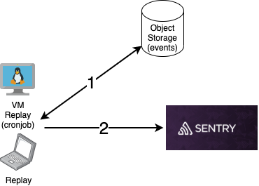

# Replay
Replay is an event traffic replay service. It was formerly presented as [The Undertaker](https://www.youtube.com/watch?v=4QEYJXjC4Jk) at Hackweek 2020.  


## Overview  
`main.go` grabs a bunch of sentry events in JSON form from Cloud Storage, updates them, and sends them to your DSN keys at Sentry.io.

## Setup

1. Create a config.yaml. See config.yaml.example.

    `SENTRY_JOB_MONITOR` is good for capturing errors in Replay if you're running it on a job.  
    `DESTINATIONS` are the dsn keys you want to send events to  
    `SOURCES` are sentry org slugs you can scrape events from, and send to your DESTINATIONS. This is by default turned off. See demo_automation.go

2. 
    Install Google Cloud SDK 303.0.0. This is for reading JSON's from the thousands we have crowdsourced and saved in Cloud Storage.

    Obtain the Google Application Credentials file, and put the file path to it in your config.yaml's `GOOGLE_APPLICATION_CREDENTIALS`.

## Run
1. `go build -o bin/main *.go`
2. `./bin/main`
3. `./bin/main -i` to ignore sending the event to Sentry
2. Look for your events in your projects on Sentry.io.

## Adding Events to the Database
1. Obtain the JSON for the event, remove the comments at the top.
2. Create a file for the JSON in `/events-errors` under the right platform sub directory, so you have a local copy.
3. Update the JSON's 'platform' value if need be.
4. Upload a copy of this file to Cloud Storage (where Replay reads it from)
5. If the platform type is new, then update `config.yaml.example` with the new platform type.
6. If the platform type is new, then add the DSN for the platform type in `config.yaml`.

## Notes
The `-i` ignore flag is for using during development, as you don't want to send malformed data or call bad URL's on Sentry.

You can pass a `prefix` for the files you want to read from Cloud Storage

Build and run quickly:
```
go build -o bin/main *.go && ./bin/main
```

[Sentry Developer Documentation](https://develop.sentry.dev/sdk/store)

For some JSON files you have to manually change the platform. For instance, java errors and android errors both have `platform:java` so change the android one to `platform:android`. And other sdk's simply report a value of `platform:other` which isn't helpful for Replay to know what kind of error it is. This is a flawed design. Ideally, should decide based on the `Sdk.name` value.

This project was originally called Undertaker because it featured a proxy middleman that captured events on their way to Sentry. Today, we take the event JSON's from Sentry.io and place them in Cloud Storage.


Accept-Encoding: gzip
`{"detail":"failed to read request body","causes":["failed to base64 decode payload","Invalid byte 31, offset 0."]}`

Content-Encoding: gzip
codified response...

{"detail":"failed to read request body","causes":["failed to read request payload","deflate decompression error"]} 